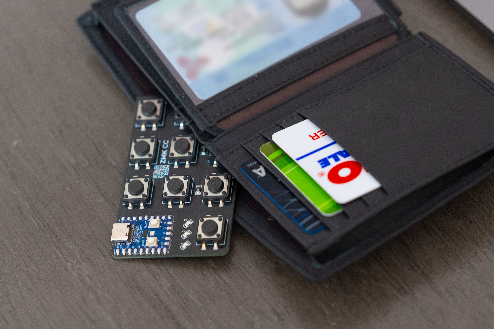
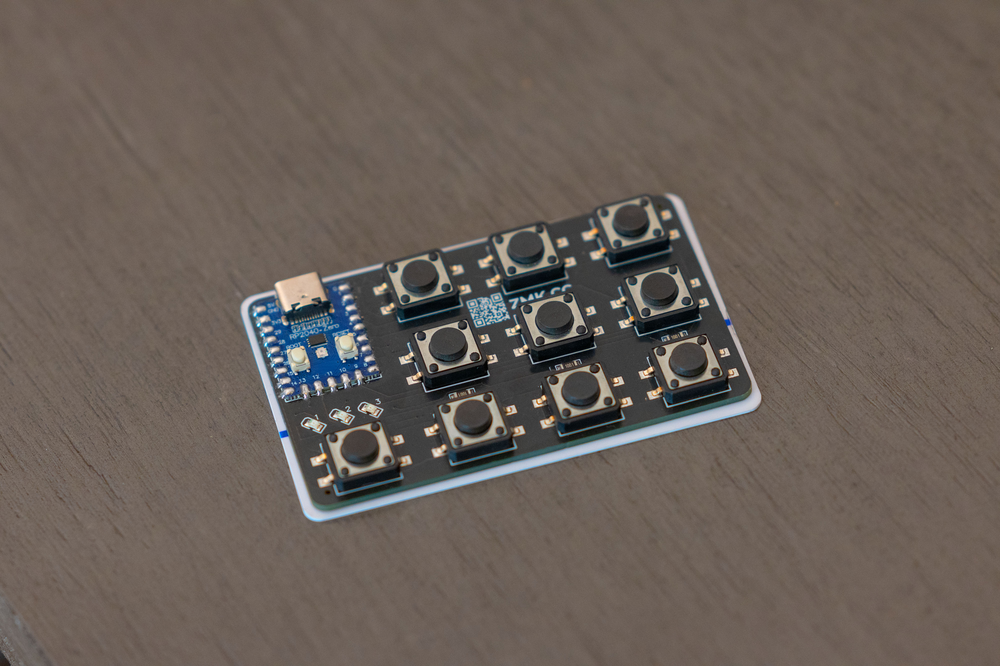
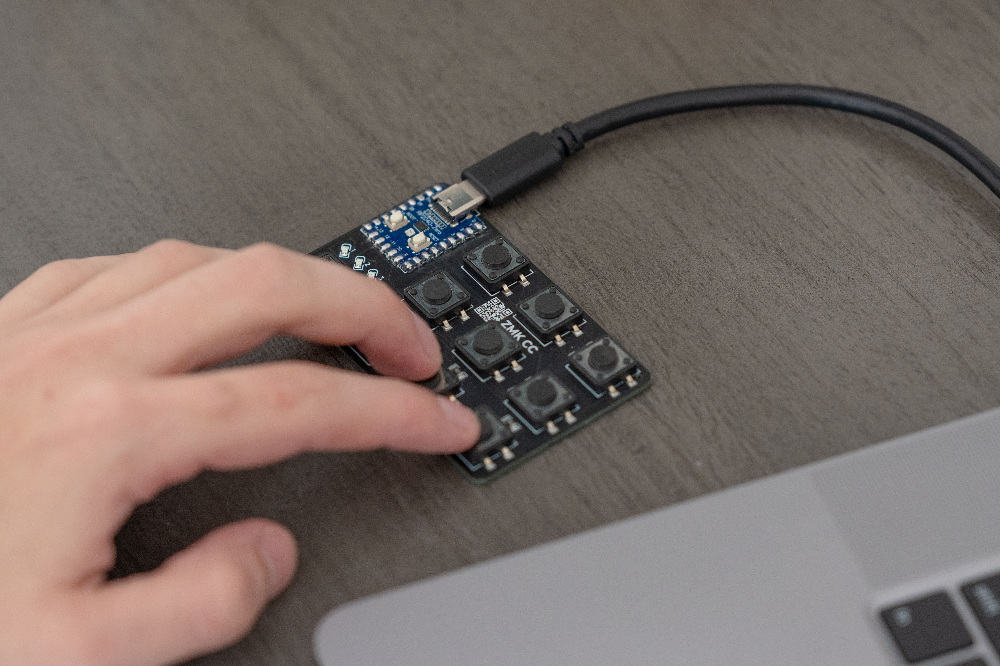
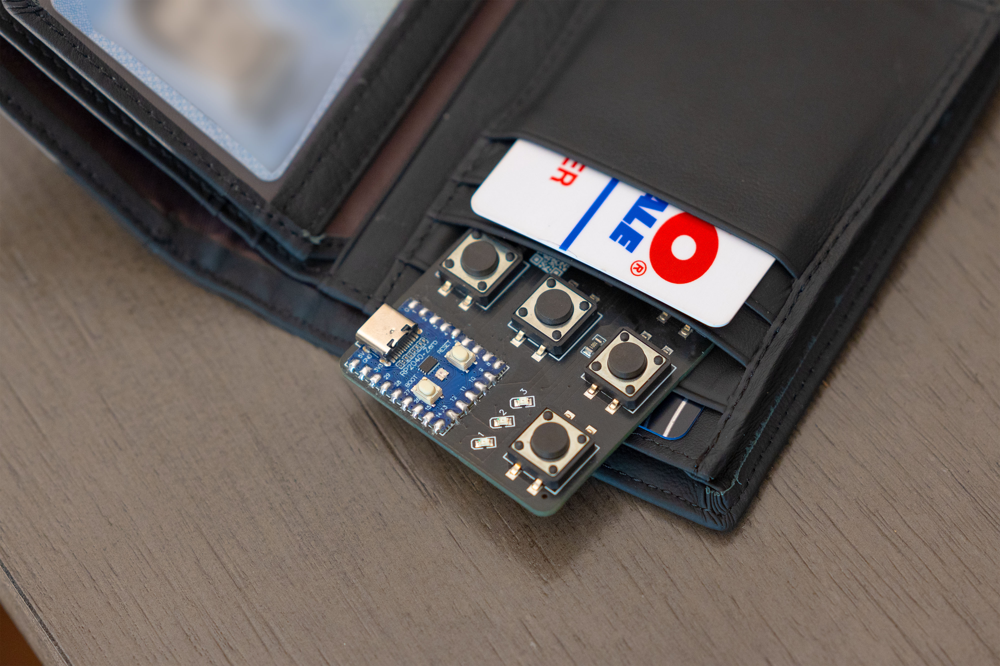
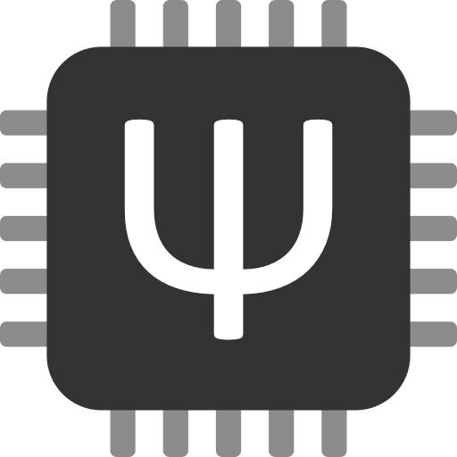
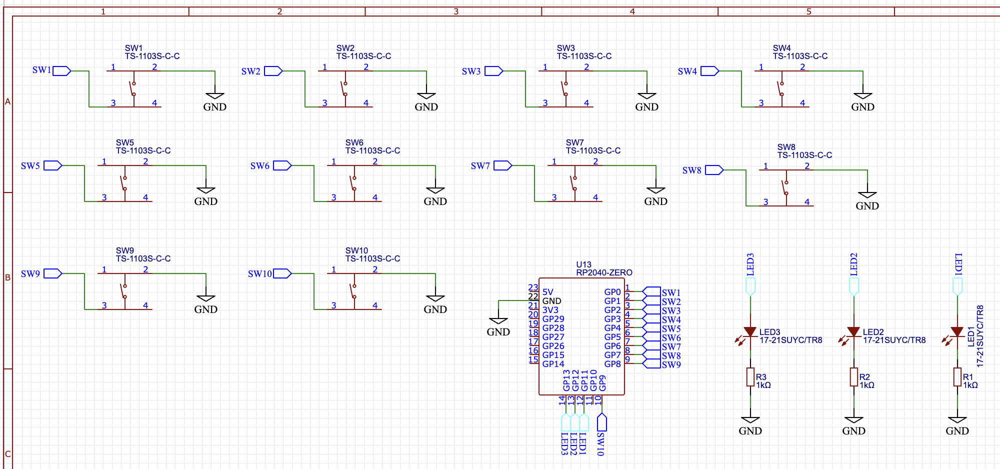
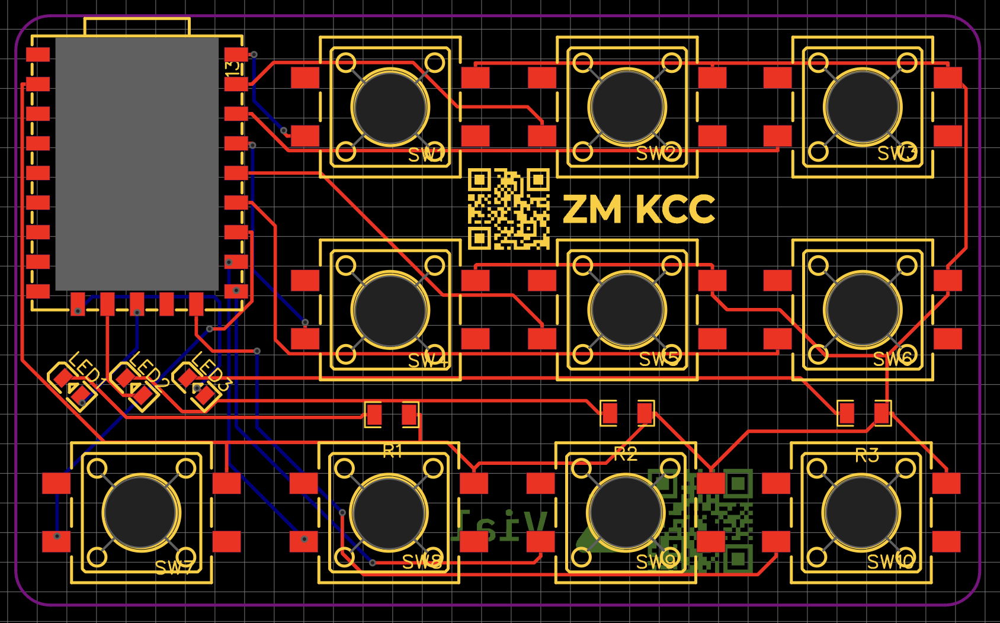

# ZM Keyboard Credit Card

Programmable 10 Key **"Card Sized"** and **"Stealthy"** Credit Card Keyboard.

  

  
  
  

## Overview

Credit Card Sized Keyboard with

- QMK / VIAL Firmware
- Hardware
  - RP2040-Zero Breakout Board
  - 10 Tactile Switches
  - 3x 1kOhm Resistors
  - 3x 0805 LEDs
  - 3x 1206 Resistors
  - Custom Made PCB

## Code/Software

⚠️⚠️⚠️ You need to be familiar with how to build/flash QMK Firmware. This Repo won't teach you how to do that. ⚠️⚠️⚠️

  
  

1. Clone/Fork [vial-qmk](https://github.com/vial-kb/vial-qmk) Repo

2. Copy the `/zm_cc` folder under **/Code** to **Cloned/Forked** `vial-qmk` Repo's `/Keyboards` Folder

3. **_Build/Compile_** the Firmware using QMK's Build Tools - https://docs.qmk.fm/newbs_getting_started  
   a) If everything is setup correctly, you should be able to compile the firmware by running `qmk compile -kb zm_cc -km vial` while in the in the root of the **Cloned/Forked** `vial-qmk` Repo

## PCB

  
  

## Hardware/Parts

- (x1) RP2040-Zero (Unsoldered) (USB-C) - [Link](https://www.amazon.com/HiLetgo-RP2040-Zero-Microcontroller-Development-Compatible/dp/B0CDWWH8HK/ref=sr_1_1_sspa?crid=3A0CV50JT93ZU&dib=eyJ2IjoiMSJ9.JkBltXz-YrmSdg4bJmDOgdzT8icktdIqYE45Bmt8qWKSDDZpfyuljRKebH-8X7WuBvrQZrzJDFGn172fkKsF9UAEgufLjqUWpMoZHlME0-nBHeC-U5JIQ8FWrZvETk-HFy4ns7aCKzSqAYohUoLtj0r8XY4BmTE0r_o_-v8bA8LfvFRUsdD28WHQiER90SGnAS3sZloqO7VkFQDKKmGt4hna3ZrYjYQfd3F1zn5ZjjI.qmMHL-HYfx5KPiWsqpha8VF82x08auRU-apGJINStG8&dib_tag=se&keywords=rp2040&qid=1730256925&sprefix=rp2040%2Caps%2C90&sr=8-1-spons&sp_csd=d2lkZ2V0TmFtZT1zcF9hdGY&psc=1)

- ⚠️⚠️ You need a decent soldering skills to assemble the SMD Parts ⚠️⚠️

  - (x3) SMD 1206 - 1kOhm Resistor [Link]()

  - (x10) SMD 4Pin 12x12x5mm Tact Switches - [Link]()

  - (x3) SMD 0805 - Single Color Yellow LED - [Link]()

 

## TODO

- [x] ~~Basic QMK/VIAL Firmware~~
- [ ] Set Layer Status to 3 LEDs

- [ ] 3D Printed Bottom Case PLate

## Credit

Designed By  

  

## Buy One Pre-made?

Sign up for the interest check at  
https://shop.ziddymakes.com/products/credit-card-keyboard

If enough people are interested, I will make a small batch of them.
  

## License

This project is licensed under the Creative Commons Attribution-NonCommercial 4.0 International License - see the [LICENSE](LICENSE) file for details. This means you can freely use and modify this project for personal use, but commercial use is not permitted.
